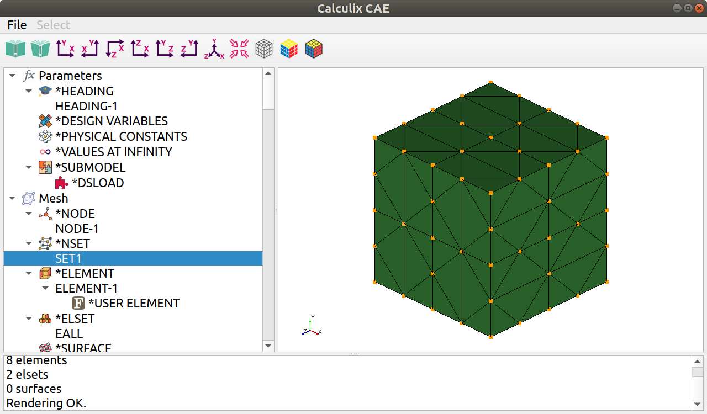

© Ihor Mirzov, July 2019.

Distributed under GNU General Public License, version 2.

  

# CalculiX CAE

GUI/pre-processor for [CalculiX CrunchiX](http://dhondt.de/). Very simple, free and open source. Program is based on CalculiX 2.15 keywords hierarchy. Written in Python3, utilizes PyQt5 and VTK.

It is implied that you have already created geometry and generated mesh in some other software like [Salome-platform](https://www.salome-platform.org/). CacluliX CAE is designed to guide you through the keywords creation sequence and is aimed to help you reach correct input file with no mistakes.

  

# Features

- Calculix keywords hierarchy with all attributes is maintaned in simple editable text file - [ccx_dom.inp](ccx_dom.inp).

- Import/export of .inp-files - one format for all needs. Program parses .inp-file and generates model on the fly, so separate format for the model is not needed. Final model is saved also with .inp format ready to be calculated by ccx.

- Solid mesh parser - [ccx_mesh.py](ccx_mesh.py) - tested on all the example CacluliX models with ability to highlight surfaces, node and element sets after mesh import. See [test.log](test.log).

- Keyword's edit dialog shows apropriate chapter of the official HTML documentation. Edit dialog is generated on the fly reading keyword's attributes from [ccx_dom.inp](ccx_dom.inp).

- Nice icons for all keywords/tree objects.

  

# Screenshots

Main window:

Create keyword dialog:

  

# Downloads

First of all you can use the source code and run [ccx_cae.py](ccx_cae.py) from terminal. Pay attention to [prerequisites](#prerequisites).

Otherwise you may download binaries (only Ubuntu is supported), extract archive and run binary *ccx_cae*.

Both sources and binaries could be found on [the release page](https://github.com/imirzov/ccx_cae/releases).

  

# Prerequisites

To run [ccx_cae.py](ccx_cae.py) or contribute first of all install VTK, PyQt5 and QT designer:

    pip3 install vtk
    pip3 install PyQt5
    pip3 install PyQtWebEngine
    sudo apt install qttools5-dev-tools

[Some examples](https://lorensen.github.io/VTKExamples/site/Python/) for getting started with VTK in Python.

Also you'll need [pyinstaller](https://www.pyinstaller.org/) to build release binaries:

    pip3 install pyinstaller

  

# TODO

More tests for all features.

Visualize BC's, constraints and loads in VTK.

Reparse *NODE, *ELEMENT, *NSET or *ELSET after edit.

Do not remove comments. Include them to apropriate tree item's INP_code.

Get all mutually exclusive arguments from the manual.

Python code (*PYTHON keyword) in INP_code for step repetition and other kind of model generation.

During keyword's edit parse arguments and pass them to Dialog.

Save display options.

Import mesh from FRD, [VTK](https://lorensen.github.io/VTKExamples/site/Python/IO/ReadLegacyUnstructuredGrid/), [VTU](https://lorensen.github.io/VTKExamples/site/Python/IO/ReadUnstructuredGrid/).

<!--
DistanceBetweenPoints:  
https://lorensen.github.io/VTKExamples/site/Python/SimpleOperations/DistanceBetweenPoints/

Screenshot:  
https://lorensen.github.io/VTKExamples/site/Python/Utilities/Screenshot/

Text actor for displaying model info:  
https://lorensen.github.io/VTKExamples/site/Python/GeometricObjects/TextActor/
-->