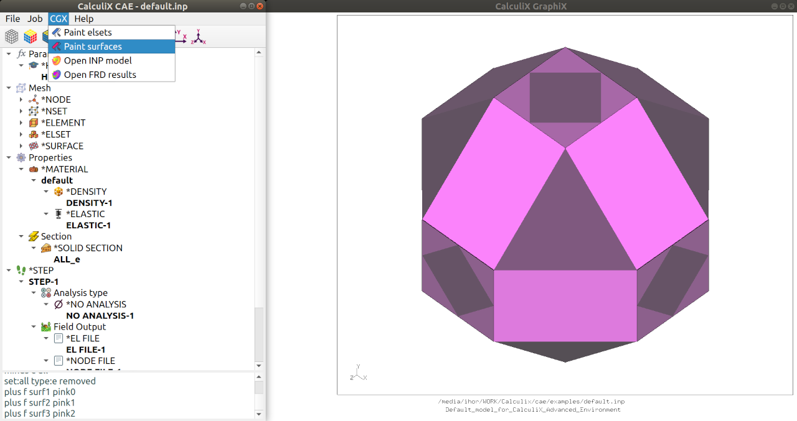
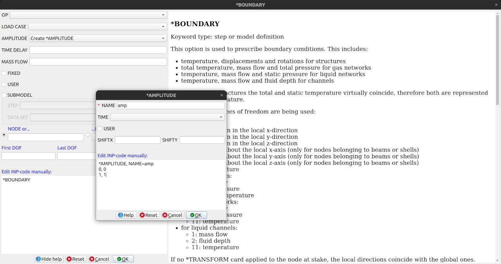
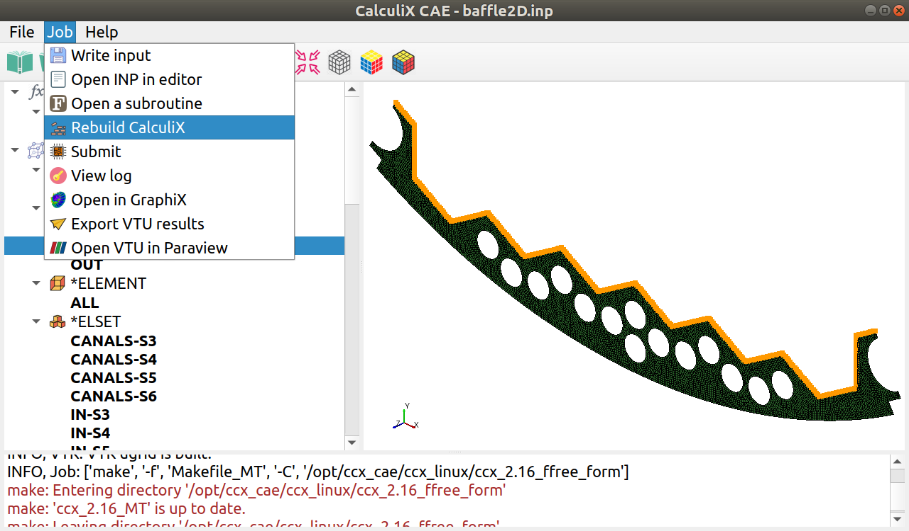
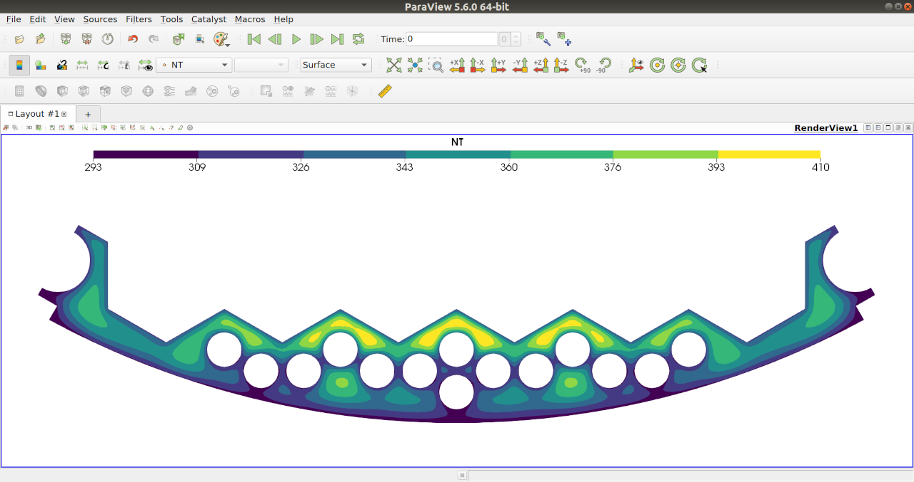

© Ihor Mirzov, July 2020  
Distributed under GNU General Public License v3.0

  

---

[Features](#features) |
[Screenshots](#screenshots) |
[Downloads](https://github.com/calculix/cae/releases) |
[How to use](#how-to-use) |
[Your help](#your-help) |
[For developers](#for-developers) |
[What's new](#whats-new) |
[TODO](#todo)

---

  

# CalculiX Adanced Environment (CAE)

CAE is a software package mainly consisting of CalculiX [GraphiX](http://calculix.de/), [CrunchiX](http://dhondt.de/) and keyword editor. The last one - is a very simple, free and open source GUI/pre-processor for CalculiX. Program is based on the keywords hierarchy, is designed to guide you through the keywords creation process and is aimed to help you reach the correct input file with no mistakes. Keyword editor is written in Python3 and utilizes PyQt5.

It is implied that you have already created geometry and generated mesh in some other software like [FreeCAD](https://www.freecadweb.org/) or [Salome-platform](https://www.salome-platform.org/).

  

# Features

- CAE comes with the latest CGX and CCX compiled for both Linux and Windows. Windows version of CGX is taken from [CalculiX Launcher v3.4](http://www.calculixforwin.com/) 

- INP format for all needs: program parses .inp-file and generates model on the fly, so separate format for the model is not needed. Final model is saved also with .inp format ready to be calculated with CCX.

- Official [HTML documentation](doc) is natively integrated into the keyword edit dialogs (Help button).

- Calculix keywords hierarchy with all attributes is maintaned in [editable XML file](config/kom.xml).

- [Solid mesh parser](src/model/parsers/mesh.py) supports includes in the input file. Tested on the all official CalculiX examples. See [mesh.log](src/model/parsers/mesh.log).

- Application's global settings could be set up in the File->Settings menu. Settings are maintained in editable Python file - it is automatically overwritten during the workflow.

- [Optimal job management](src/model/job.py):

    - if you use subroutines, CalculiX sources could be automatically recompiled from GUI;
    - run analysis directly from GUI;
    - open results in GraphiX or convert to VTU format and open them in [Paraview](https://www.paraview.org).

- Supports UNV mesh import.

- Cute modern design with [nice icons](img).

  

# Screenshots

Keyword editor and CGX windows with imported mesh and painted surfaces:

"New keyword" dialog with corresponding chapter from HTML manual:

Keyword editor and CGX windows with calculated model:

Calculation result exported to Paraview:

  

# How to use

[Download latest release](https://github.com/calculix/cae/releases) (binaries or source code), unpack it and allow to be executed (give permissions).

The intended workflow is:

- create geometry and mesh in [FreeCAD](https://www.freecadweb.org/) or [Salome-platform](https://www.salome-platform.org/),
- save mesh as UNV or export it to INP with [Salome to CalculiX mesh exporter](https://github.com/psicofil/SalomeToCalculix),
- import INP or UNV mesh into CAE and continue creating model,
- if needed, edit Fortran subroutines and rebuild CCX (menu Job->Rebuild CalculiX),
- submit job from CAE,
- view job result in GraphiX or export it to the Paraview post-processor.

Run the software with command (works both for binaries and source code):

    in Linux:       ./cae.sh
    in Windows:     cae.bat

**Attention!** To run sources you'll need Python3 with PyQt5. Linux also needs Xlib. See [requirements.txt](./requirements.txt).

You can edit default startup model name in File->Settings or leave it empty or even pass it as an argument to open on startup:

    in Linux:       ./cae.sh -inp yourmodel.inp
                    ./cae.sh -inp yourmodel.unv
    in Windows:     cae.bat -inp yourmodel.inp
                    cae.bat -inp yourmodel.unv

Another way to run CAE is (from 'src' directory):

    python3 cae.py
    python3 cae.py -inp yourmodel.inp
    python3 cae.py -inp yourmodel.unv

  

# Your help

Please, you may:

- Simply use this software and ask questions.
- Share your models and screenshots.
- Do something from the [TODO-list](#TODO).
- Report problems by [posting issues](https://github.com/calculix/cae/issues). Please, attach ./examples/default.log (or other logs) to the problem report.

  

# For developers

Suppose you already have [Python 3](https://www.python.org/downloads/). Open terminal in CAE directory and install dependencies with command:

    pip3 install -r requirements.txt

You may also need libraries:

    qttools5-dev-tools
    pyinstaller
    pycallgraph

Use [make_release.py](make_release.py) to create releases (pyinstaller needed):

    python3 make_release.py

CAE uses converters:

- [ccx2paraview](https://github.com/calculix/ccx2paraview) - CalculiX to Paraview converter (frd to vtk/vtu)
- [unv2ccx](https://github.com/calculix/unv2ccx) - Salome universal to CalculiX converter (unv to inp)

The source code for the CalculiX solver is taken from the [free_form_fortran project](https://github.com/calculix/free_form_fortran) - this version has much better code folding and readability.

In Windows to work with subroutines and to recompile CalculiX sources from CAE you'll need [cygwin](https://www.cygwin.com/). Install it to 'C:\\cygwin64' with:
- gcc-g++ 7.3.0-3
- gcc-fortran 7.3.0-3
- make 4.2.1-2
- perl 5.26.3-2

**Attention!** Do not move CCX or CGX from 'bin' directory!

  

# What's new in v0.9.0

- CalculiX 2.17.
- Linux version of CGX has 'cmap' command and [custom colormaps](https://github.com/calculix/cgx/releases/tag/v2.17.cmap): classic, viridis, inferno and turbo.
- Using external python packages ccx2paraview and unv2ccx.

  

# TODO

Examples and training materials:
- Prool's INP-templates and snippets.
- Interface for [Martin Kraska examples](https://github.com/mkraska/CalculiX-Examples).
- Menu Help: wiki, YouTube videos for beginners. 

Python API:
- Invent some kind of Python API. Possibly use [pycalculix](https://github.com/spacether/pycalculix) and [pyccx](https://github.com/drlukeparry/pyccx).
- Python code (*PYTHON keyword) in the INP_code for step repetition and other kind of model generation.
- Martin Kraska: support the param.py parametrization mechanism.

FreeCAD:
- Embeded CAE into FreeCAD.
- Connector for FreeCAD: listen to port and obtain meshed geometry.

CGX:
- Highlight loads and boundary conditions.
- Thread for periodic checking of CGX WID. Connect/disconnect CGX automatically in the background.

Parsers:
- Peparse mesh/model after tree.actionDeleteImplementation.
- Parsers for loads and boundary conditions.
- Have a look at [INP parser](https://github.com/crmccreary/AbqParse): My parser does not support keyword line continuation.

Importer:
- treeView: import certain keyword with descendants (tree branch) from INP-file.
- Interface for materials import: right click on *Material -> Import.
- [Meshio converter](https://github.com/nschloe/meshio).
- Import mesh from FRD, [VTK](https://lorensen.github.io/VTKExamples/site/Python/IO/ReadLegacyUnstructuredGrid/), [VTU](https://lorensen.github.io/VTKExamples/site/Python/IO/ReadUnstructuredGrid/), [Gmsh](http://gmsh.info/), Abaqus INP and ODB.
- Open .fbd/.fbl and forward to CGX. Then import generated model.

Other:
- Implement keyword dialog as tab on main window.
- Settings Dialog: add buttons to Pathes to open files.
- Try to [build CalculiX with mingw-w64](https://mechanicalhacks.wordpress.com/2011/03/29/building-calculix-to-run-native-on-64-bit-windows/). [Attention!](http://hillyuan.blogspot.com/2013/10/build-calculix261-in-mingw64.html)
- Folder 'tests': move all logs and architecture schemes there.
