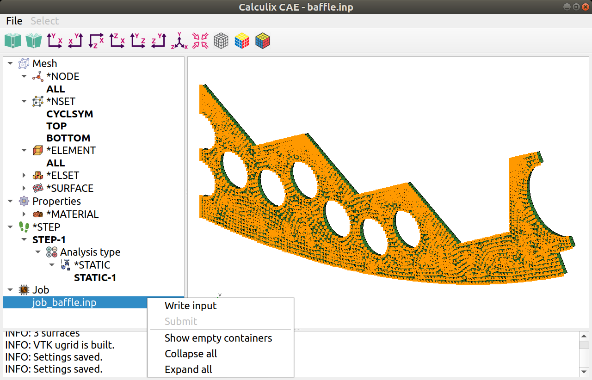

© Ihor Mirzov, July 2019.

Distributed under GNU General Public License, version 2.

  

# CalculiX CAE

GUI/pre-processor for [CalculiX CrunchiX](http://dhondt.de/). Very simple, free and open source. Program is based on CalculiX 2.15 keywords hierarchy. Written in Python3, utilizes PyQt5 and VTK.

It is implied that you have already created geometry and generated mesh in some other software like [Salome-platform](https://www.salome-platform.org/). CacluliX CAE is designed to guide you through the keywords creation sequence and is aimed to help you reach correct input file with no mistakes.

  

# Features

- Calculix keywords hierarchy with all attributes is maintaned in simple editable text file - [ccx_dom.inp](ccx_dom.inp). Keyword's edit dialog is based on it.

- Import/export of .inp-files - one format for all needs. Program parses .inp-file and generates model on the fly, so separate format for the model is not needed. Final model is saved also with .inp format ready to be calculated by ccx.

- Solid mesh parser - [ccx_mesh.py](ccx_mesh.py) - tested on the all example CacluliX models - with ability to highlight surfaces, node and element sets after mesh import. See [test.log](test.log).

- "New keyword" dialog shows apropriate chapter of the official HTML documentation. The dialog is generated on the fly reading keyword's attributes from [ccx_dom.inp](ccx_dom.inp).

- Nice icons for all keywords/tree objects.

  

# Screenshots

Main window with imported mesh and highlighted node set:

"New keyword" dialog with corresponding chapter from HTML manual:

  

# Prerequisites

Suppose you already have [Python 3](https://www.python.org/downloads/). So first of all install VTK, PyQt5 and PyQtWebEngine:

    pip3 install vtk PyQt5 PyQtWebEngine

That's all if you're going only to use CalculiX CAE.

For developers to edit GUI-forms [ccx_dialog.ui](ccx_dialog.ui) and [ccx_cae.ui](ccx_cae.ui) you'll need QT designer:

    sudo apt install qttools5-dev-tools

To create release binaries install [pyinstaller](https://www.pyinstaller.org/):

    pip3 install pyinstaller

  

# How to use

Despite of your operating system it is recommended to use the source code - just call [ccx_cae.py](ccx_cae.py) from terminal. Otherwise you may [download binaries](https://github.com/imirzov/ccx_cae/releases), extract archive and run *ccx_cae* or *ccx_cae.exe*.

    multiplatform: python3 ccx_cae.py
    in Linux: ./ccx_cae
    in Windows: ./ccx_cae.exe

Pass name of your INP model as a '--mesh' argument to open it at start:

    multiplatform: python3 ccx_cae.py --mesh=your_model.inp
    in Linux: ./ccx_cae --mesh=your_model.inp
    in Windows: ./ccx_cae.exe --mesh=your_model.inp

To create release binaries files use commands:

    pyinstaller ccx_cae.py

  

# Downloads

Both sources and binaries could be found on [the release page](https://github.com/imirzov/ccx_cae/releases).

  

# TODO

**Improvements and bugfixes:**

- Get all mutually exclusive keyword arguments from the manual.

- Better ViewSurfaceWithEdges - implement it manually without EdgeVisibilityOn().

- Better surface highlight: remove original face for pure color.

- During keyword's edit parse arguments and pass them to Dialog. Reparse *NODE, *ELEMENT, *NSET or *ELSET after edit.

- Do not remove comments. Include them into apropriate tree item's INP_code.

**New features:**

- Visualize BC's, constraints and loads in VTK.

- Python code (*PYTHON keyword) in INP_code for step repetition and other kind of model generation.

- Save display options.

- Import certain keyword with descendants from .inp-file.

- Import mesh from FRD, [VTK](https://lorensen.github.io/VTKExamples/site/Python/IO/ReadLegacyUnstructuredGrid/), [VTU](https://lorensen.github.io/VTKExamples/site/Python/IO/ReadUnstructuredGrid/).

- Run job from CAE.

<!--
    DistanceBetweenPoints:  
    https://lorensen.github.io/VTKExamples/site/Python/SimpleOperations/DistanceBetweenPoints/

    Screenshot:  
    https://lorensen.github.io/VTKExamples/site/Python/Utilities/Screenshot/

    Text actor for displaying model info:  
    https://lorensen.github.io/VTKExamples/site/Python/GeometricObjects/TextActor/
-->

