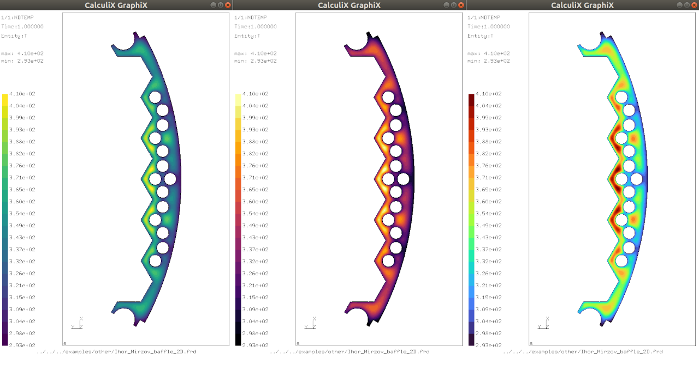

© Ihor Mirzov, 2019-2023  
Distributed under GNU General Public License v3.0

  

---

[Downloads](https://github.com/calculix/cae/releases) |
[Features](#features) |
[Screenshots](#screenshots) |
[How to use](#how-to-use) |
[Your help](#your-help) |
[For developers](#for-developers) |
[TODO](#todo)

---

  

# CalculiX Adanced Environment (CAE)

CAE is a software package consisting of CalculiX [GraphiX](http://calculix.de/), [CrunchiX](http://dhondt.de/) and keyword editor. The last one - is a very simple, free and open source GUI/pre-processor for CalculiX. Program is based on the keywords hierarchy, is designed to guide you through the keywords creation process and is aimed to help you reach the correct input file with no mistakes.

It is implied that you have already created geometry and generated mesh in some other software like [FreeCAD](https://www.freecadweb.org/) or [Salome-platform](https://www.salome-platform.org/).

  

# Features

- CAE comes with the latest CGX and CCX compiled for both Linux and Windows. Analysis [runs on all cores](https://github.com/calculix/cae/issues/22) automatically.

- CAE is distributed with [standalone Python](https://github.com/indygreg/python-build-standalone). All requirements will be installed automatically on app start. To start using the software you have to simply download it, unpack and run.

- INP format for all needs: program parses .inp-file and generates model on the fly, so separate format for the model is not needed. Final model is saved also with .inp format ready to be calculated with CCX. Robust INP importer algorithm is tested on over 20 000 INP files, including Abaqus models ([see log](src/importer.log)).

- Official [HTML documentation](doc) is natively integrated into the keyword edit dialogs (Help button).

- Calculix keywords with all attributes are maintained in [editable XML file](config/kw_list.xml). It allows for all CalculiX keywords to have their own GUI - [keyword edit dialogs](img/KeywordDialog).

- [Solid mesh parser](src/model/parsers/mesh.py) supports includes in the input file. Tested on the all official CalculiX examples. See [mesh.log](src/model/parsers/mesh.log).

- Application's global settings could be set up in the File->Settings menu. Settings are maintained in editable Python file - it is automatically overwritten during the workflow.

- CGX window [is connected](src/gui/connection.py) to the keyword editor and accepts commands from it.

- Cute modern design with [nice icons](img).

- [Optimal job management](src/gui/job.py):

    - if you use subroutines, CalculiX sources could be automatically recompiled from GUI;
    - run analysis directly from GUI;
    - open results in GraphiX or convert to VTU format and open them in [Paraview](https://www.paraview.org).

- CAE uses converters:

    - [ccx2paraview](https://github.com/calculix/ccx2paraview) - CalculiX to Paraview converter (frd to vtk/vtu)
    - [unv2ccx](https://github.com/calculix/unv2ccx) - Salome universal to CalculiX converter (unv to inp)

  

# Screenshots

Keyword editor and CGX windows with imported mesh and painted surfaces:

"New keyword" dialog with corresponding chapter from HTML manual:

Keyword editor and CGX windows with calculated model:

New CGX colormaps - viridis, inferno, turbo:

Calculation result exported to Paraview:

  

# How to use

[Download latest release](https://github.com/calculix/cae/releases) and unpack it.

Linux only: open terminal in unpacked CAE directory, allow all files to be executed:

    sudo chmod -R 777 ./*

Run the software with command (or double click those files):

    in Linux:       ./cae.sh
    in Windows:     cae.bat

You can edit default startup model name in File->Settings or leave it empty.

The intended workflow is:

- create geometry and mesh in [FreeCAD](https://www.freecadweb.org/) or [Salome-platform](https://www.salome-platform.org/),
- save mesh as UNV or export it to INP with [Salome to CalculiX mesh exporter](https://github.com/psicofil/SalomeToCalculix),
- import INP or UNV mesh into CAE and continue creating model,
- if needed, edit Fortran subroutines and rebuild CCX (menu Job),
- submit job from CAE,
- view job result in GraphiX or export it to post-process in Paraview.

In Windows to work with subroutines and to recompile CalculiX sources from CAE you'll need [cygwin](https://www.cygwin.com/). Install it to 'C:\\cygwin64' with:
- gcc-g++ 11.3.0-1
- gcc-fortran 11.3.0-1
- make 4.3-1
- perl 5.32.1-2
- libglut3 3.2.1-1

**Attention!** Do not move CCX or CGX from 'bin' directory!

  

# Your help

Please, you may:

- Star this project.
- Simply use this software and ask questions.
- Share your models and screenshots.
- Report problems by [posting issues](https://github.com/calculix/cae/issues). Please, attach ./cae.log (or other logs) to the problem report.
- Do something from the [TODO-list](#TODO) as a developer.
- Maybe draw better [icon set](img).
- Or even [become a sponsor to me](https://github.com/sponsors/imirzov).

  

# For developers

Keyword editor is written in Python3 and utilizes PyQt5.

As a developer you may also need libraries:

    qttools5-dev-tools
    pycallgraph

  

# TODO

Examples and training materials:
- Shortcut/symlink to folder in another repo: examples.
- Prool's INP-templates and snippets.
- Interface for [Martin Kraska examples](https://github.com/mkraska/CalculiX-Examples).
- Menu Help: wiki, YouTube videos for beginners. 

Python API:
- Invent some kind of Python API. Possibly use [pycalculix](https://github.com/spacether/pycalculix), [pyccx](https://github.com/drlukeparry/pyccx) and [pycgx](https://github.com/zagl/pycgx). Here are [pycgx examples](https://github.com/zagl/ccx-user).
- Pay attention to [pyvista](https://www.pyvista.org/) and [Python tetgen interface](https://tetgen.pyvista.org/).
- [Meshpresso Mesh Converter](https://cofea.readthedocs.io/en/latest/meshpresso/index.html)
- Python code (*PYTHON keyword) in the INP_code for step repetition and other kind of model generation.
- Martin Kraska: support the param.py parametrization mechanism.

FreeCAD:
- Embeded CAE into FreeCAD.
- Connector for FreeCAD: listen to port and obtain meshed geometry.

CGX:
- Connect to CGX via socket ([client/server](https://www.geeksforgeeks.org/socket-programming-cc/)). Make CGX accepts client connections.
- Master window / toolset with list of CGX commands.
- Highlight loads and boundary conditions.
- https://www.x.org/releases/X11R7.5/doc/man/man3/XSetFont.3.html

Parsers:
- Reparse mesh/model after tree.actionDeleteImplementation.
- Reparse mesh/model after new item creation. New elsets/nodesets are not highlighted in CGX.
- Parsers for loads and boundary conditions.

Importer:
- treeView: import certain keyword with descendants (tree branch) from INP-file.
- Interface for materials import: right click on *Material -> Import.
- [Meshio converter](https://github.com/nschloe/meshio).
- Import mesh from FRD, [VTK](https://lorensen.github.io/VTKExamples/site/Python/IO/ReadLegacyUnstructuredGrid/), [VTU](https://lorensen.github.io/VTKExamples/site/Python/IO/ReadUnstructuredGrid/), [Gmsh](http://gmsh.info/).
- Open .fbd/.fbl and forward to CGX. Then import generated model.

KeywordDialog:
- Insert Combo widget into Table cell.
- Table widget: redundant comma in the end of line.
- Draw a separator (black line) in GUI for group with newline=1.
- Argument form='Combo' with sub-arguments: regenerate GUI on Combo index change. Current form='VOr' is not user friendly.
- Unittests for KeywordDialog: compare generated INP code with the one which should be.

Other:
- Zip ccx sources. Extract on first start from checks.py module.
- Main Window: filter tree items - search item. 
- Main Window: treeView - highlight background of the collections.
- Open collective / Patreon.
- Video: Download CAE, unpack and run. Capture video with OBS Studio, edit with DaVinci Reslove.
